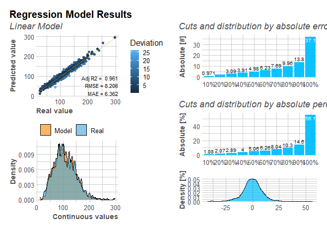
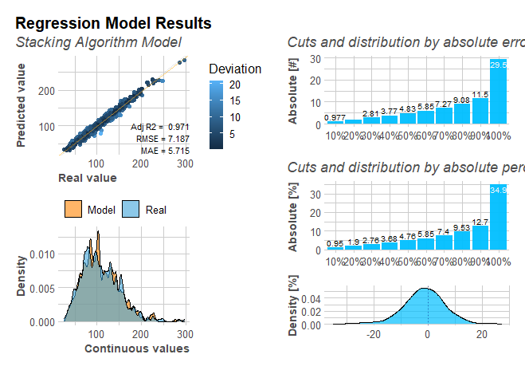
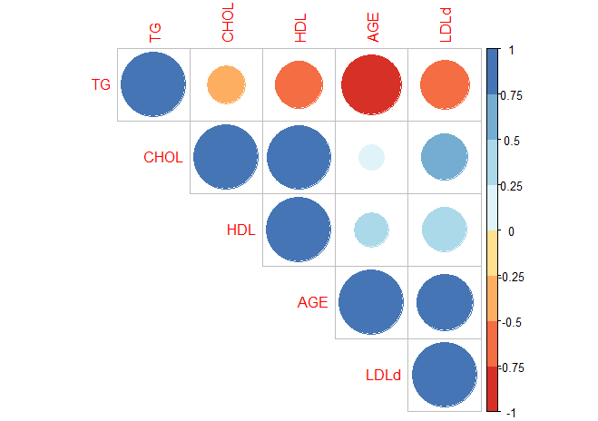

 
```{r, include = FALSE}
knitr::opts_chunk$set(
  collapse = TRUE,
  comment = "#>"
)
```


# Introduction
**This Vignette is about the first part of the LDLcalc package, which includes Calculation and Predictive Methods for LDL Cholesterol. The SampleData is a dataset included in the LDLcalc package. It contains the values of cholesterol (CHOL), HDL, triglycerides (TG) and direct LDL, as well as the age of 2000 cases. By using this data set the user can have the first experience with the package, as demonstrated in the examples below.**

[LDLcalc](https://cran.r-project.org/package=LDLcalc) is an R package for calculation and prediction of LDL Cholesterol through 12 different equations and 10 different machine learning methods, quickly, easy and economically. It can also calculate the variance of LDL and the Atherogenic Index of Plasma (AIP), as demonstrated in another vignette (Variance calculation of LDL and AIP).   


# Installation Guide 

1. Download and install:  

    - R (https://www.r-project.org/)
    - R studio (https://www.rstudio.com/)

2. Open R studio:

```
install.packages("LDLcalc")
```
# How-to Guides

After the Installation is completed, package functions are visible:

```{r, functions}
library(LDLcalc)
ls("package:LDLcalc")

```

# Usage and Example

This R Package provides a pre-trained model to the user, which is called ``model``, as well a ``sample data``, thus enabling the user to have a first experience with the R package.

# Data Visualization through Graph Drawing

For the visualization of data, three functions are offered. The ``ReportMultiPlot``, the ``ComparisonPlot`` and the ``corr_Plot`` function.
\

The ReportMultiPlot function, provides information about the regression model results, the distribution plot of the error of the model (both absolute and relative values), as well as the density plot.

### Regression results plot

The most obvious plot to study for a linear regression model is the regression itself. If the predicted values vs the real values are plotted, it can be determined by visual inspection how close they are to our reference line of 45°. if points are far away from the line and without any definite trend, this indicates a weak to non-existent linear relationship. if, on the other hand all points lie on the diagonal, this can be a sign of overfitting.

### Distribution plot

This is a simple comparison between the real values and the predicted ones. The more similar these two curves are, the better. Smaller size to this plot is assigned because it provides an idea of the whole picture more than a specific metric.

### The distribution by absolute and relative error and density plot for the real relative (percent) error.

In the background, the error of each estimation IS calculated (both absolute and relative), and sorted from the smallest error to the largest one. Finally, they are split into different bins with the same number of observations. As can be seen, we can conclude how much of the test set had an error below a value or percentage with the first two plots. The third one is a density plot for the real relative error, with a 0-reference line, where the distribution of the errors by range can be determined.

The ``ComparisonPlot`` is a function, which allows the user to compare all models and see their MAE (Mean Absolute Error). It provides useful information about the quality of the models.

The ``Corrplot`` function provides the user information about the correlation between the data.

\


**The first step for estimation of LDL Cholesterol, is to train the model. This can be carried out with the function ``LDL_ML_Main``**. This function initializes and returns the ML prediction model with a diagram of 5 plots, relating different statistics on the newly created model, if Reportmultiplot=TRUE. For details, see the corresponding function help.

**Example:**

``model = LDL_ML_Main(SampleData,0.7,"lm",ReportMultiPlot=TRUE)``





\


Another way to derive a model for LDL estimation, is by using the stacking algorithm. The stacking algorithm is an ensemble machine learning algorithm that entails using a machine learning model to learn the best way to combine predictions from contributing ensemble members. The function for this is ``LDL_ML_Main_StackingAlgorithm``. 
\

**Example:**

``stackModel = LDL_ML_Main_StackingAlgorithm(SampleData,0.8,ReportMultiPlot=TRUE,ComparisonPlot=TRUE)``


Another useful function of our Package is the ``LDL_ML_Main_All_Models``. It allows  the training of all available models at once.

{width=75%}


{width=75%}


\

**Example:**

``allModels = LDL_ML_Main_All_Models(SampleData,0.8,ReportMultiPlot = FALSE,ComparisonPlot=FALSE)``

\
**After training our model, we can proceed with the estimation of LDL values using new CHOL, HDL and TG values. The function we will use is ``LDL_ML_predict``.**\

\
**Example:**

Estimation of new data:

``LDL_estimation = LDL_ML_predict(model,data.table::data.table(CHOL=170.5,HDL=35.12,TG=175))``

Estimation using the stacked Model:

``LDL_estimation = LDL_ML_predict(stackModel,data.table::data.table(CHOL=170.5,HDL=35.12,TG=175)``

Estimation using allModels: 

``LDL_estimation = LDL_ML_predict(allModels,data.table::data.table(CHOL=170.5,HDL=35.12,TG=175))``

\
**Apart from LDL estimation using ML methods, this package provides functions  to calculate LDL through equations described in the literature (e.g Friedewald and other equations). We can use the function ``LDL_eq`` to calculate the LDL through equations of our choice (there are 12 available equations; see the function help). Another function is the ``LDLallEq``, which can calculate the LDL with all available equations at once. See examples below.**
\

**Example of ``LDL_eq``:**

``LDL_eq(170.5,35.12,230,"Martin360")``\


**Example of ``LDLallEq``:**

``LDLallEq(170,35,174)``\


**Another useful function of the ``LDLcalc`` package is the ``Corr_Plot`` function. It draws a correlation plot in order to see the correlation between different columns of the data.**\

**Example:**

``Corr_Plot(SampleData[1:5])``


{width=75%}
\


The full documentation is available here: **[Reference manual](https://cran.r-project.org/package=LDLcalc)**.

Installation and examples are available either on **[Reference manual](https://cran.r-project.org/package=LDLcalc)** or on **[LDLcalctutorial](https://sciencesandresearch.com/wp-content/uploads/2021/10/LDLcalcTutorial-1.pdf)**.

Feel free to contact us for any issue or question about our package at **[Petros Paplomatas](mailto:p.paplomatas@hotmail.com)** or **[Kostas Anagnostopoulos](mailto:kanagno@gmail.com)**.


